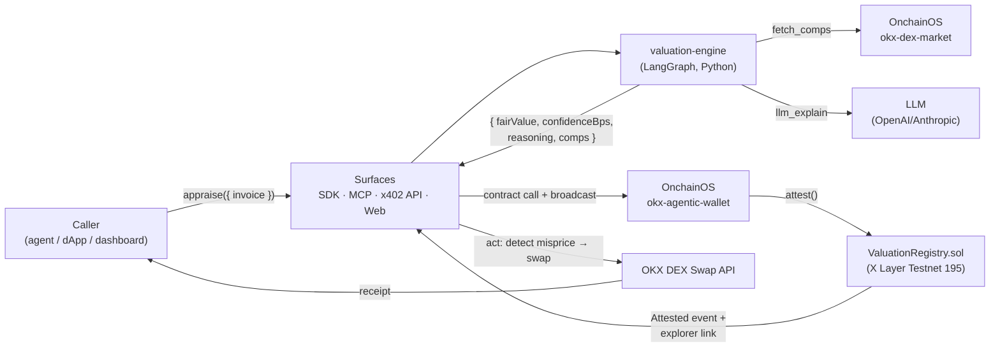

# Architecture — Pricewise

> System design for the active AI RWA appraisal agent. Read with `Memory.md` (facts) and `PRD.md` (requirements).

---

## 1. System overview

Pricewise is an **active AI appraisal agent, exposed as an OKX.AI Agent Service Provider**. It turns an unpriced illiquid/private real-world asset (an invoice/receivable) into an **onchain, timestamped, confidence-scored fair-value attestation** on X Layer — then **acts**: it compares that attested value to the asset's live OKX DEX ask and trades mispriced invoices. The hero of the product is the full **appraise → attest → act** loop, not the valuation number.

Three planes:
- **Brain** (Python/LangGraph) — the AI valuation engine. Deterministic number + LLM explanation.
- **Chain** (Solidity/X Layer) — `ValuationRegistry.sol` holds the attestations.
- **Surfaces** (TypeScript) — SDK, MCP server, x402 HTTP endpoint (the ASP), and an end-user dashboard.

## 2. Data flow (end to end)



## 3. Valuation engine (the AI centerpiece)

Python + LangGraph. A directed graph so each step is observable and testable.

| Node | Kind | Responsibility |
|---|---|---|
| `parse_invoice` | deterministic | Extract `{ faceValue, currency, debtor, issueDate, dueDate }`, compute `daysOutstanding`. |
| `fetch_comps` | IO (OnchainOS) | Call `okx-dex-market` for peer RWA/invoice tokens → `[{ token, price, volume24h, liquidity }]`. Fallback: seeded static peer set. |
| `score_debtor_risk` | **deterministic** | Map debtor tier/sector → risk weight → annualized discount rate `r`. |
| `discount` | **deterministic** | Present value: `fairValue = faceValue / (1 + r)^(daysOutstanding/365)` (minus fees). This is the canonical number. |
| `llm_explain` | LLM | Produce human reasoning + red flags; **propose** `confidenceBps`. May only **lower** confidence within a band around a heuristic ceiling — cannot override `fairValue`. |
| `emit` | deterministic | Assemble `{ fairValue, confidenceBps, reasoning, comps[] }`. Refuse if `confidenceBps < floor (2500)`. |

**Why this shape:** the number is always defensible (pure finance math), while the LLM is non-removable (it generates the reasoning + confidence that make the product an *AI* valuation, not a calculator). This protects the "application of AI" criterion without sacrificing credibility.

### 3b. Active loop — mispricing detection (what makes it an *agent*, not a feed)

After a `ValuationAttestation` is onchain, a separate lightweight pass turns Pricewise from a passive oracle into an **active agent** (the OKX-winner shape):

1. **`fetch_ask`** — read the invoice token's live ask on the OKX DEX via `okx-dex-market`.
2. **`detect_misprice`** — *deterministic*: if `ask < attestedFairValue × (1 − threshold)` (e.g., threshold 5%), the invoice is flagged mispriced (underpriced → buy opportunity).
3. **`act`** — propose/execute a priced swap of the invoice token via the **OKX DEX Swap API**, sized to the confidence and the gap. Optional human/ policy confirmation for size above a cap.

This loop is the demo's hero (see §10) and the direct answer to the `free-AI` + `passive-feed` autopsy risks: a prompt can produce a number; it cannot autonomously attest onchain and act on a live misprice.

## 4. Contracts (Solidity / Foundry)

### `ValuationRegistry.sol`
- Role-gated (`APPRAISER_ROLE`) — only the appraiser agent's wallet (via `okx-agentic-wallet`) may write.
- Storage:
  ```solidity
  struct Attestation {
      uint96  fairValue;      // asset units (e.g. 6-dec USDC-pegged)
      uint16  confidenceBps;  // 0–10000
      address appraiser;
      uint40  timestamp;
      bytes32 reasoningHash;  // keccak256(reasoning string) for integrity
  }
  mapping(bytes32 assetId => Attestation) public attestations;
  ```
- `attest(bytes32 assetId, uint96 fairValue, uint16 confidenceBps, bytes32 reasoningHash)` — overwrites prior, updates `timestamp`, emits `Attested`.
- `getLatest(bytes32 assetId) view` returns the current attestation.
- `assetId = keccak256(abi.encodePacked(chainId, tokenContract, invoiceRef))`.
- No upgrades, no admin recovery of funds (no funds held) — minimal attack surface.

### `InvoiceToken.sol`
- Minimal ERC-20 (mintable, 6 decimals) representing a tokenized invoice — exists only so the **action** step has a real token to quote/swap on the OKX DEX.

## 5. OnchainOS integration (sponsor-tech centrality)

| Primitive | Direction | Used for |
|---|---|---|
| `okx-dex-market` | IN | `fetch_comps` — peer prices/volume/liquidity |
| `okx-agentic-wallet` | OUT | `contract call` + `broadcast` → `ValuationRegistry.attest` |
| OKX DEX Swap API | OUT | priced quote/swap of `InvoiceToken` at fair value |
| `okx-ai` (ERC-8004) | META | register/list Pricewise as an ASP on OKX.AI |
| Agent Payments Protocol (x402) | MONETIZE | `apps/api` returns 402 → settle → run SDK |

### Kill-check (every primitive is load-bearing)
Remove `okx-dex-market` → no comps (valuation degrades to a guess). Remove `ValuationRegistry`/X Layer → no onchain attestation (no product). Remove `okx-agentic-wallet` → can't write onchain. Remove OKX DEX → no action (loop incomplete). Remove `okx-ai`/x402 → not an OKX.AI service. The sponsor's tech is structural, not decorative.

## 6. Surfaces

| Surface | Stack | Role |
|---|---|---|
| `@pricewise/sdk` | TS + viem | One-call `appraise()` → engine → onchain attest → return ref. Hero API. |
| `@pricewise/mcp-server` | TS + MCP SDK | 6–10 tools for any MCP client (Claude Desktop). Agent-native surface. |
| `apps/api` | TS + Hono + x402 | **A2MCP ASP listing surface**: pay-per-call HTTP. 402 → settle → SDK. |
| `apps/web` | Next.js + Tailwind + shadcn | **End-user dashboard**: paste invoice → reasoning → onchain attestation → action. Lifts user-value/growth criteria. |

## 7. Security model

| Layer | Mechanism | Enforcement point |
|---|---|---|
| Contract | only appraiser can attest | `ValuationRegistry.sol` `onlyRole(APPRAISER_ROLE)` |
| Contract | confidence + value bounds | revert on `confidenceBps > 10000` or `fairValue == 0` |
| Offchain | valuation integrity | deterministic core; LLM cannot set the number |
| Offchain | low-quality block | confidence floor (2500 bps) refuses publication |
| Offchain | reasoning integrity | store `keccak256(reasoning)` onchain; UI shows match |
| Ops | key hygiene | `.env` gitignored; appraiser wallet scoped to `attest` only |

> Pricewise holds **no custodial funds** — the registry stores attestations only. The only asset movement is the optional OKX DEX swap, initiated by the caller, not by Pricewise.

## 8. Tech stack

- **Contracts:** Solidity + Foundry (`forge`); viem for TS interaction.
- **Brain:** Python + LangGraph + FastAPI; OpenAI or Anthropic for `llm_explain`.
- **Surfaces:** TypeScript; Hono (x402); `@modelcontextprotocol/sdk`; viem.
- **Web:** Next.js + Tailwind + shadcn/ui (Cloudflare Workers via OpenNext, or Vercel).
- **Sponsor:** OnchainOS (`okx-dex-market`, `okx-agentic-wallet`, OKX DEX Swap, `okx-ai`, x402).
- **Quality:** pnpm workspaces, `tsconfig.base.json`, changesets, GitHub Actions CI (`forge test`, typecheck, pytest), Playwright (stretch).

## 9. Mainnet launch path (for Liquidity Grant / ecosystem contribution)

The hackathon requires **testnet by Aug 21 + a mainnet launch**. Plan:
1. Identical contract bytecode; redeploy `ValuationRegistry` to X Layer **Mainnet (196)** with a dedicated appraiser EOA.
2. Point `@pricewise/sdk`/`apps/*` at mainnet RPC + mainnet `VALUATION_REGISTRY_ADDRESS` via env.
3. Use production OnchainOS credentials (not sandbox).
4. List the mainnet ASP on OKX.AI; keep testnet as a public sandbox.
5. Mainnet is a **documented, low-risk path** (no funds custodied) — not a rushed weekend deploy.

## 10. Active-agent demo (≤90s) — the loop is the hero

The autopsy flagged that the LLM's valuation number alone is one-prompt-reproducible (`free-AI`). So the demo must star the **appraise → attest → act** loop, with the LLM reasoning as *support*, not the headline.

1. Paste a sample invoice → engine produces `{ fairValue, confidence, reasoning }` (LLM reasoning shown briefly, grounded in `okx-dex-market` comps).
2. **Attest** → live `ValuationAttestation` written to X Layer; explorer link appears (the verifiable, non-prompt-reproducible artifact).
3. **Detect** → agent compares attested fair value to the invoice token's live OKX DEX ask → flags it **mispriced** (ask < fair value).
4. **Act** → agent proposes/executes a priced OKX DEX swap on the misprice → receipt. ← *This is the hero beat.*
5. One-line `pricewise.appraise()` SDK call shown for the agent-native angle.

Lead with the loop (steps 2–4). A judge should walk away remembering "an agent that prices an invoice onchain and trades the misprice" — not "an LLM that values an invoice."
