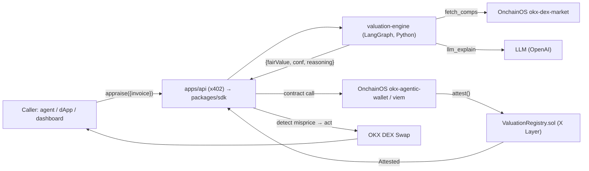

# Pricewise

-brightgreen)
%20%E2%9C%93%20%2F%20anvil-blue)


> **An active AI appraisal agent for illiquid/private real-world assets** (invoices/receivables). It appraises with an LLM, attests the fair value **onchain on X Layer**, and **acts on mispriced invoices** via the OKX DEX — shipped as an OKX.AI Agent Service Provider.

Oracles price *liquid* RWA (equities/ETFs/T-bills). **Illiquid/private RWA — invoices — has no price and no oracle.** Pricewise is the active AI appraisal agent that fills that gap: **appraise → attest → act**. The loop is the product, not the LLM number.

## Why it's not a crowded oracle (positioning)
Onchain RWA price feeds already exist (Chainlink, DIA xReal, RedStone) — but they cover *liquid* RWA with *deterministic* oracles. Pricewise appraises **illiquid/private RWA** that no oracle covers, and the product is the full **appraise → onchain attestation → act** loop (a prompt can produce a number; it can't autonomously attest onchain and trade a misprice). Full rationale: [PRD.md §1b](./PRD.md).

## Architecture



## Repo

```
contracts/            ValuationRegistry.sol + InvoiceToken.sol (Foundry, 12 tests)
valuation-engine/     Deterministic core + FastAPI /appraise + LangGraph (22 tests)
packages/sdk/         @pricewise/sdk — appraise + attest (viem) (6 tests)
packages/mcp-server/  @pricewise/mcp-server — 6 MCP tools over stdio (3 tests)
apps/api/             Hono x402 pay-per-call front (2 tests)
apps/web/             Vite + React dashboard
examples/demo-local.sh  end-to-end on anvil (no real keys)
```

## Quick start

```bash
# contracts
cd contracts && forge install OpenZeppelin/openzeppelin-contracts --no-git && forge test   # 12 green

# engine (pure-stdlib core; comps/LLM upgrade when keys are set)
cd ../valuation-engine && python3 -m venv .venv \
  && .venv/bin/pip install fastapi 'uvicorn[standard]' httpx openai langgraph \
  && PYTHONPATH=. .venv/bin/python -m unittest discover -s tests   # 22 green

# TS workspaces
cd .. && pnpm install && pnpm -r build && pnpm -r test              # sdk 6, mcp 3, api 2
```

### End-to-end on anvil (verified)
```bash
./examples/demo-local.sh
# 1) appraise (engine): fairValue=24814.21 conf=8000bps
# 2) attest onchain (anvil): tx mined
# 3) read back from ValuationRegistry: fairValue=24814212213 conf=8000 appraiser=0x7099…
# 4) detect misprice: mispriced=true gap=1199bps
```

### Run the surfaces
```bash
# engine
( cd valuation-engine && PYTHONPATH=. .venv/bin/uvicorn pricewise_engine.app:app --port 8000 )
# x402 api
pnpm --filter @pricewise/api start
# dashboard
pnpm --filter @pricewise/web dev
# MCP server (Claude Desktop / any MCP client)
pnpm --filter @pricewise/mcp-server start
```

### Deploy the contract
```bash
# X Layer testnet (needs funded key + appraiser address)
cd contracts && APPRAISER_ADDRESS=0x… DEPLOYER_PRIVATE_KEY=0x… \
  forge script script/ValuationRegistry.s.sol --rpc-url $XLAYER_TESTNET_RPC --broadcast
```

## Security
Pricewise holds **no custodial funds**. Role-gated writes, bounds-checked attestation, deterministic valuation core (LLM can't override the number), confidence floor. See [SECURITY.md](./SECURITY.md).

## Status & seams
- **Done & green:** contracts, engine core + integration, SDK, MCP server, x402 api, dashboard, end-to-end anvil demo, **public testnet deploy**, CI.
- **Deployed (X Layer testnet, chain 1952):** `ValuationRegistry` at [`0xB50eCDE9c94AaFBAF8aaC1e337B2c694223e4E79`](https://www.oklink.com/xlayer-test/address/0xB50eCDE9c94AaFBAF8aaC1e337B2c694223e4E79) — appraiser `0xd65c3f42cd889E471802B2c8d183E50a5f098F15`; a sample attestation was written and read back live.
- **Needs external credentials/infra (documented seams):** real OnchainOS comps (OKX API keys), real LLM explain (OpenAI key), mainnet launch, npm publish of `@pricewise/*`, OKX.AI ASP listing, hackathon submission.

## Stack
Solidity + Foundry · TypeScript + viem / MCP / Hono / React · Python + LangGraph + FastAPI · OKX OnchainOS (`okx-dex-market`, `okx-agentic-wallet`, OKX DEX Swap, `okx-ai`, x402).

## Spec docs
[PRD](./PRD.md) · [Architecture](./Architecture.md) · [Tasks](./Tasks.md) · [Memory](./Memory.md) · [Handoff](./Handoff.md) · [Security](./SECURITY.md) · [Contributing](./CONTRIBUTING.md) · [Changelog](./CHANGELOG.md)

> Informational estimate only — not financial advice. © Pricewise (MIT).
